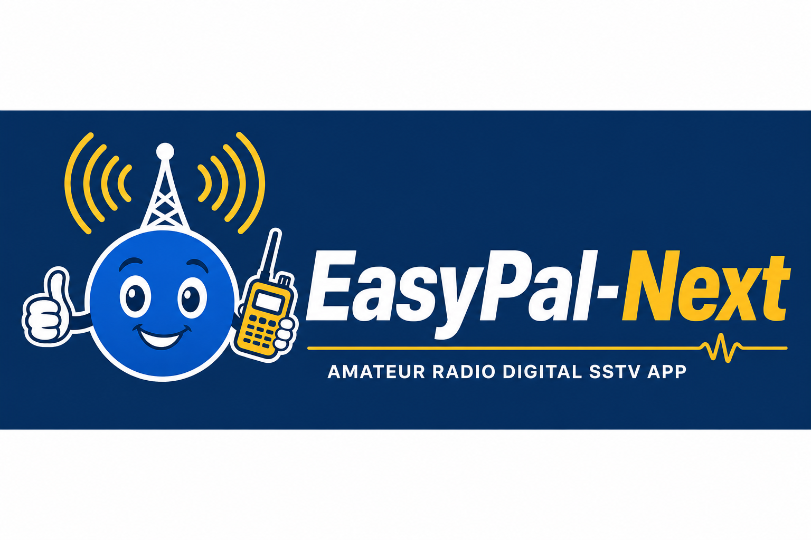

# EasyPal-Next

<p align="center">
  
</p>

**An open-source digital SSTV application — built in memory of Erik Sundstrup (VK4AES / VK4ESK, SK).**

EasyPal brought error-corrected image and file transfer to amateur radio. When Erik became a silent key, development of the closed-source EasyPal ended. EasyPal-Next continues that legacy as a modern, patent-free, community-maintained successor.

## Features (v0.2.0)

- **DATAC3** digital file/image transfer via Codec2 / FreeDV (loopback + on-air)
- **Perfect-mode** error correction via zfec + modem LDPC
- **Waterfall text** TX headers (WFTxt) with live spectrum display during RX
- PySide6 desktop UI: RX pane, waterfall, log panel, settings
- Mobile/tablet **LAN gallery** for viewing decoded images on your phone
- **VOX**, serial PTT, and Hamlib CAT radio backends
- Windows installer build (PyInstaller + Inno Setup)

## Quick validation

```bat
python scripts\verify-codec2.py      REM requires libcodec2.dll
python scripts\loopback-transfer.py  REM end-to-end SHA256 loopback test
pytest
```

On-air testing: see [docs/on-air-test.md](docs/on-air-test.md).

## Brand

Cartoon-style logo in **royal blue**, **golden yellow**, and **white**. Assets in [`resources/brand/`](resources/brand/) (see [brand README](resources/brand/README.md)).

## Download / install (release)

Tagged releases build `EasyPal-Next-Setup-0.2.0.exe` via GitHub Actions. For local builds see [packaging/windows/README.md](packaging/windows/README.md).

Unsigned installers may show a Windows SmartScreen prompt — use **More info → Run anyway** or sign with an EV code signing certificate.

## Development environment (Windows)

EasyPal-Next targets **Python 3.12** (3.11 also works). Python 3.14+ is not supported —
dependencies like `zfec` need pre-built wheels that are not yet available for newer versions.

### One-time setup

**Option A — automated script:**

```bat
scripts\setup-dev.bat
```

**Option B — manual:**

```bat
winget install Python.Python.3.12
cd EasyPal-Next
py -3.12 -m venv .venv
.venv\Scripts\activate
python -m pip install --upgrade pip
pip install -e ".[dev]"
```

### Daily use

```bat
cd EasyPal-Next
.venv\Scripts\activate
python -m easypal_next      REM run the desktop app
pytest                      REM run tests
```

Your machine may also have Python 3.14 installed — always activate `.venv` before working
so you use 3.12. Verify with `python --version` (should show 3.12.x).

### Installed versions on this machine

| Python | Path | Use for EasyPal-Next? |
|--------|------|------------------------|
| 3.12 | `py -3.12` | **Yes** — project venv |
| 3.14 | `py -3.14` (default `python`) | No — missing zfec wheels |

## Quick start (development)

**Python 3.11 or 3.12 required.**

```bash
python -m venv .venv
.venv\Scripts\activate          # Windows
pip install -e ".[dev]"

# libcodec2 must be installed separately — see docs below
python -m easypal_next
```

## libcodec2 (required for modem)

EasyPal-Next loads `libcodec2.dll` (Windows) via ctypes. Build from [drowe67/codec2](https://github.com/drowe67/codec2) or place the DLL in:

- `packaging/windows/redist/libcodec2.dll` (development)
- Next to `EasyPal-Next.exe` (installed release)

Set path in config: `modem.libcodec2_path`

## Configuration

Defaults ship in `config/defaults.yaml`. User overrides:

```
%APPDATA%\EasyPal-Next\config.yaml
```

## Project structure

```
resources/brand/   Logos and icons (blue / yellow / white cartoon brand)
src/easypal_next/
├── app/          Application bootstrap and paths
├── audio/        Sound card I/O
├── modem/        FreeDV / Codec2 integration
├── fec/          zfec packet transport
├── waterfall/    Spectrum text painting (WFTxt)
├── radio/        PTT / CAT abstraction
├── network/      LAN gallery + REST/WebSocket
├── community/    Future community server client
└── ui/           PySide6 interface
```

## Building the Windows installer

See [packaging/windows/README.md](packaging/windows/README.md).

## License

Copyright (c) 2026 **Shane Daley M0VUB** (ShaYmez) \<shane@freestar.network\>

MIT — see [LICENSE](LICENSE).

## In memory

Dedicated to **Erik Sundstrup VK4AES (VK4ESK)**, creator of EasyPal, whose work inspired a generation of digital SSTV operators. Open source keeps it alive for many years to come.
